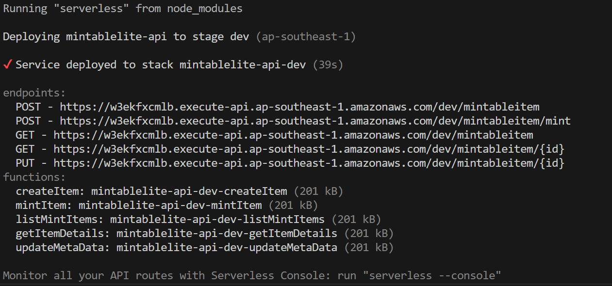

# MintableLite

## Getting Started

It is essential to possess an AWS account for the successful setup of the project. Additionally, please ensure that your AWS Identity and Access Management (IAM) account is allowed with the requisite permissions for DynamoDB, S3, Lambda Functions, API Gateway, Cognito, and CloudFormation. For more [documentation..](mintablelite-api\docs\documentation.md)

### Install & Setup AWS resources

1. Install and Setup AWS-CLI

2. Configure AWS in command Line
    ```
    aws configure
    ```

3. Install serverless
    ```
    npm i -g serverless
    ```

4. Clone this repo to your local machine:
    ```
    git clone https://github.com/SuNandarLin/mintablelite.git
    ```

5. Install the required dependencies:
    ```
    npm install
    ```

6. Deploy using CloudFormation, running serverless deploy command:
    ```
    serverless deploy --region REGION
    ```

    Now All AWS resources are created and set up. Endpoints are generated. You will be able to see the result in terminal if you scucceed deploying.
    

### Executing API endpoints

To be able to execute API secured with Cognito, a Cognito User is necessary to authenticate. 

1. Create a user in user pool using email as username and password with 6 minimum characters.

2. To confirm user status, run aws-cognito-idp command
    ```
    aws cognito-idp admin-set-user-password --user-pool-id USER_POOL_ID --username USER_NAME --password PASSWORD --permanent
    ```

3. Generate token to authenticate
    ```
    aws cognito-idp initiate-auth --auth-flow USER_PASSWORD_AUTH --auth-parameters USERNAME=USER_NAME,PASSWORD=PASSWORD --client-id CLIENT_ID --region REGION
    ```
4. COPY the idToken from result and use as a Bearer Token to authenticate in executing secure APIs

5. Execute APIs referring to the [API documentation](/mintablelite-api\docs\MintableLite-API.postman_collection.json)